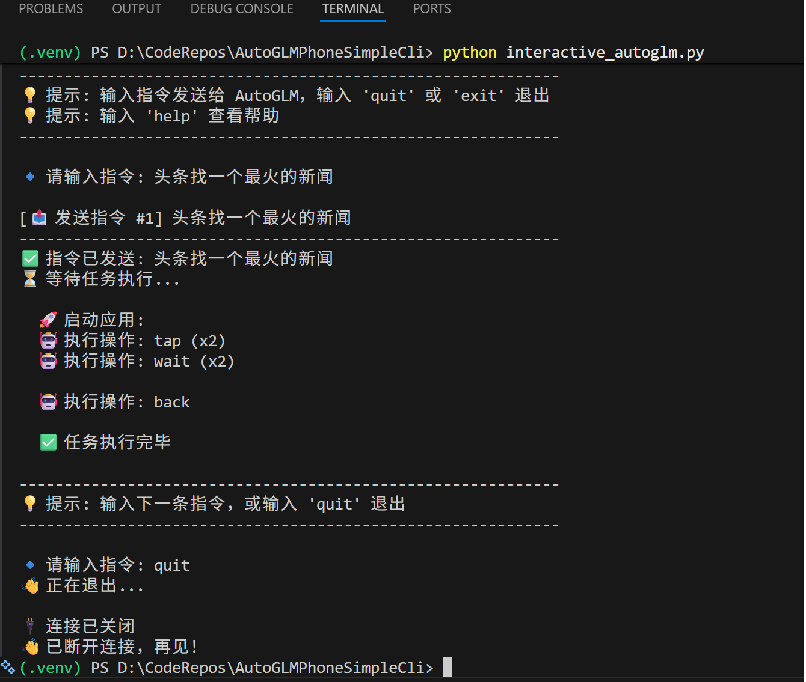

# AutoGLM Phone CLI

AutoGLM Phone API 的交互式命令行客户端，支持通过自然语言指令控制手机虚拟机执行任务。

[English](#english) | [中文](#中文)

---

<a name="中文"></a>
## 中文

### 📖 项目简介

本项目是一个基于 Python 开发的命令行工具，通过 WebSocket 连接到智谱 AI 的 AutoGLM Phone API，允许用户以对话方式发送指令，实时查看手机自动化任务的执行过程和结果。

### ✨ 功能特性

- **🚀 实时交互** - WebSocket 长连接，指令发送与结果实时同步
- **📱 操作可视化** - 美观的终端输出，显示点击、滑动、输入等操作详情
- **🔧 调试模式** - 支持 `debug` 命令切换，查看原始 JSON 消息
- **⚡ 智能等待** - 自动等待任务完成，无需手动轮询
- **🛡️ 状态管理** - 自动检测连接状态、虚拟机初始化状态

### 📋 环境要求

- Python 3.11+
- 有效的 AutoGLM API Key

### 🔨 安装步骤

#### 1. 克隆仓库

```bash
git clone <repository-url>
cd AutoGLMPhoneSimpleCli
```

#### 2. 配置 VSCode 开发环境（推荐）

##### 2.1 安装必要扩展

1. 打开 VSCode，按 `Ctrl+Shift+X` 打开扩展面板
2. 搜索并安装以下扩展：
   - **Python**（Microsoft 官方扩展）
   - **Python Debugger**（可选，用于调试）

##### 2.2 创建虚拟环境（自动）

**推荐方式：VSCode 自动检测**

1. 打开项目文件夹（`File` → `Open Folder`）
2. VSCode 检测到 `requirements.txt` 后，右下角会弹出提示：
   > "We noticed a requirements.txt file. Would you like to create a virtual environment?"
3. 点击 **"Create Environment"**
4. 选择 **"Venv"**
5. 选择 Python 3.11+ 解释器版本
6. VSCode 会自动创建 `.venv` 并安装依赖

**备选方式：命令面板**

1. 按 `Ctrl+Shift+P` 打开命令面板
2. 输入并选择 **"Python: Create Environment"**
3. 选择 **"Venv"**
4. 选择 Python 3.11+ 解释器
5. 勾选 **"requirements.txt"** 自动安装依赖

##### 2.3 选择 Python 解释器

确保 VSCode 使用虚拟环境的 Python：

1. 按 `Ctrl+Shift+P` 打开命令面板
2. 输入并选择 **"Python: Select Interpreter"**
3. 选择路径为 `./.venv/Scripts/python.exe`（Windows）或 `./.venv/bin/python`（Mac/Linux）

或在状态栏左下角直接点击 Python 版本，选择虚拟环境解释器。

##### 2.4 验证环境配置

按 `` Ctrl+` `` 打开 VSCode 终端，执行：

```bash
# 查看当前使用的 Python 路径（应指向 .venv）
where python  # Windows
which python  # Mac/Linux

# 查看已安装的包
pip list
```

#### 3. 配置 API Key

在项目根目录创建 `.env` 文件：

```env
AUTO_GLM_API_KEY=your_api_key_here
```

### 🎮 使用方法

```bash
python interactive_autoglm.py
```

启动后，输入指令即可控制手机虚拟机执行任务。

#### 📱 执行效果查看

指令发送后，你可以通过以下方式查看执行效果：

1. **终端实时输出** - CLI 会显示 AutoGLM 的操作步骤（点击、滑动、输入等）
2. **AutoGLM 云手机界面** - 在 AutoGLM 官方平台（如智谱 AI 开放平台）的云手机预览界面中，实时观看任务执行画面

> 💡 **提示**：执行任务时，建议在手机里打开 AutoGLM App的云手机页面，与 CLI 配合使用，边下指令边看执行效果。

#### 运行截图



#### 交互命令

| 命令 | 说明 |
|------|------|
| `help` | 显示帮助信息 |
| `status` | 查看连接状态 |
| `example` | 显示示例指令 |
| `debug` | 切换调试模式（显示原始 JSON） |
| `quit` / `exit` / `q` | 退出程序 |

#### 示例指令

```
帮我在小红书找三篇云南的旅游攻略汇总一篇
打开微信，给张三发消息说晚上一起吃饭
在美团搜索附近的火锅店
打开淘宝搜索 iPhone 16 的价格
在抖音搜索美食视频
```

### 📁 项目结构

```
.
├── interactive_autoglm.py   # 主程序：交互式客户端
├── test_autoglm.py          # 测试脚本
├── requirements.txt         # 依赖列表
├── .env                     # 环境变量（API Key）
└── README.md                # 项目文档
```

### 🔌 API 说明

- **服务端点**: `wss://autoglm-api.zhipuai.cn/openapi/v1/autoglm/developer`
- **认证方式**: Bearer Token (`Authorization: Bearer {API_KEY}`)
- **依赖库**: `websocket-client`, `python-dotenv`

---

<a name="english"></a>
## English

### 📖 Introduction

A command-line interface for AutoGLM Phone API, enabling natural language control of mobile virtual machines through WebSocket connections.

### ✨ Features

- **🚀 Real-time Interaction** - WebSocket connection for instant command execution and results
- **📱 Visual Operation Feedback** - Beautiful terminal output showing taps, swipes, inputs, etc.
- **🔧 Debug Mode** - Toggle with `debug` command to view raw JSON messages
- **⚡ Smart Waiting** - Automatically waits for task completion
- **🛡️ State Management** - Auto-detects connection and VM initialization status

### 📋 Requirements

- Python 3.11+
- Valid AutoGLM API Key

### 🔨 Installation

#### 1. Clone Repository

```bash
git clone <repository-url>
cd AutoGLMPhoneSimpleCli
```

#### 2. Configure VSCode Environment (Recommended)

##### 2.1 Install Required Extensions

1. Open VSCode, press `Ctrl+Shift+X` to open Extensions panel
2. Search and install:
   - **Python** (Microsoft official extension)
   - **Python Debugger** (optional, for debugging)

##### 2.2 Create Virtual Environment (Automatic)

**Recommended: VSCode Auto-Detection**

1. Open project folder (`File` → `Open Folder`)
2. VSCode will detect `requirements.txt` and show a notification:
   > "We noticed a requirements.txt file. Would you like to create a virtual environment?"
3. Click **"Create Environment"**
4. Select **"Venv"**
5. Choose Python 3.11+ interpreter
6. VSCode will auto-create `.venv` and install dependencies

**Alternative: Command Palette**

1. Press `Ctrl+Shift+P` to open Command Palette
2. Type and select **"Python: Create Environment"**
3. Select **"Venv"**
4. Choose Python 3.11+ interpreter
5. Check **"requirements.txt"** to auto-install dependencies

##### 2.3 Select Python Interpreter

Ensure VSCode uses the virtual environment Python:

1. Press `Ctrl+Shift+P` → **"Python: Select Interpreter"**
2. Select path like `./.venv/Scripts/python.exe` (Windows) or `./.venv/bin/python` (Mac/Linux)

Or click the Python version in the bottom-left status bar.

##### 2.4 Verify Environment

Press `` Ctrl+` `` to open VSCode terminal:

```bash
# Check Python path (should point to .venv)
where python  # Windows
which python  # Mac/Linux

# Check installed packages
pip list
```

#### 3. Configure API Key

Create a `.env` file in the project root:

```env
AUTO_GLM_API_KEY=your_api_key_here
```

### 🎮 Usage

```bash
python interactive_autoglm.py
```

#### 📱 Viewing Execution Results

After sending a command, you can view the execution in two ways:

1. **Terminal Output** - CLI displays AutoGLM's operation steps (taps, swipes, inputs, etc.)
2. **AutoGLM Cloud Phone Interface** - Watch real-time task execution on the cloud phone preview page of the AutoGLM App

> 💡 **Tip**: When executing tasks, we recommend opening the AutoGLM app in your phone app alongside the CLI to see the results in real-time as you issue commands.

#### Screenshot


#### Available Commands

| Command | Description |
|---------|-------------|
| `help` | Show help information |
| `status` | Check connection status |
| `example` | Show example instructions |
| `debug` | Toggle debug mode (show raw JSON) |
| `quit` / `exit` / `q` | Exit the program |

---

### 📄 License

[MIT License](LICENSE)
